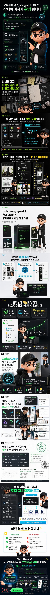

# codex-sangpye-skill

<p align="center">
  <a href="examples/demo/skill_hero.png">
    
  </a>
</p>

<p align="center"><sub>↑ 스킬 공식 홍보 이미지 (1080×12720). 클릭 시 원본.</sub></p>

---

> **한국 이커머스 상세페이지(상폐)를 ChatGPT 구독만으로 자동 생성하는 Codex 스킬.**
> Korean e-commerce product detail pages generated from your ChatGPT Plus/Pro subscription — no OpenAI API key required.

**English version:** [README.en.md](README.en.md)

상품 사진 1~14장 + 한국어 브리프 → **13섹션 이미지 + 1080×12720 합성본** 1장. 당신의 `codex login` OAuth 세션을 그대로 사용합니다. 별도 API 키 발급/과금 불필요.

---

## 🚀 Codex OAuth로 시작하기 (가장 먼저 읽을 것)

이 스킬의 핵심 아이디어: **OpenAI API 키 없이, ChatGPT 구독(Plus/Pro)만으로 돌아간다.**

내부적으로 `codex responses` 서브커맨드를 통해 당신의 OAuth 세션을 재사용합니다. 결과적으로:

- 키 관리 안 함 · 별도 billing 없음 · ChatGPT 쿼터 안에서 돌아감
- `gpt-5.4` 멀티모달 분석 + `image_generation` 툴 5회 병렬 호출 → 13섹션 자동 생성
- 보통 **5~10분** 소요 (한가할 땐 ~5분, ChatGPT 서버가 혼잡하면 최대 15분). 재시도 로직이 `server overloaded`/`rate_limit`를 자동으로 흡수합니다.

### 필수 사전 준비 (3가지)

```bash
# 1. codex CLI 최신 버전 (>= 0.121.0)
npm install -g @openai/codex@latest
codex --version   # codex-cli 0.123.0 또는 이상

# 2. ChatGPT OAuth 로그인 (API 키 아님!)
codex login       # 프롬프트에서 "Sign in with ChatGPT" 선택

# 3. CODEX_API_KEY 미설정 (OAuth를 덮어씀)
echo "${CODEX_API_KEY:-<unset>}"     # <unset> 이어야 함
```

> `OPENAI_API_KEY`는 `codex responses`가 런타임에서 **무시**합니다. 쉘에 있어도 상관없음. 오직 `CODEX_API_KEY`만 OAuth를 덮어씁니다.

### 한 방 설치

**macOS / Linux / WSL**
```bash
curl -fsSL https://raw.githubusercontent.com/NewTurn2017/codex-sangpye-skill/main/install.sh | bash
```

**Windows (PowerShell)**
```powershell
iwr -useb https://raw.githubusercontent.com/NewTurn2017/codex-sangpye-skill/main/install.ps1 | iex
```

스크립트가 하는 일:
1. `uv`, `codex >= 0.121.0`, OAuth 로그인 상태 검증
2. `uv tool install` 로 `sangpye` CLI 글로벌 설치
3. `SKILL.md`를 `~/.claude/skills/codex-sangpye/`에 드롭 (Claude Code 스킬 자동 인식)
4. smoke check

스크립트를 먼저 읽고 싶으면 [install.sh](install.sh) / [install.ps1](install.ps1)를 확인하세요. 재실행 안전 (idempotent).

### 설치가 끝났으면 — 첫 실행

```bash
sangpye \
  --image ./your_product.jpg \
  --prompt "무선 이어폰, ANC 탑재, 30시간 배터리, IPX5 방수" \
  --category electronics \
  --output ./out
```

5분 뒤:
```json
{"job_id":"a1b2c3d4","combined":"/abs/.../combined.png","sections":["/abs/.../01_hero.png", ...],"elapsed_sec":312.5}
```

---

## 🎯 출력물 구성 (Output Spec)

### 13 섹션 (감정 여정 기반)

| # | 섹션 | 높이 | 역할 |
|---|---|---|---|
| 1 | **Hero** | 1600px | 긴급성 헤더 + 메인 이미지 |
| 2 | Pain | 800px | 공감 — "이런 고민 있으신가요?" |
| 3 | Problem | 800px | 문제 정의 |
| 4 | **Story** | 1200px | Before→After 스토리 |
| 5 | Solution | 800px | 솔루션 소개 |
| 6 | How | 900px | 작동 방식 시각화 |
| 7 | **Proof** | 1420px | 사회적 증거 (리뷰/수치) |
| 8 | Authority | 800px | 권위/전문성 |
| 9 | Benefits | 1200px | 핵심 혜택 |
| 10 | Risk | 800px | 리스크 제거 (보증/환불) |
| 11 | Compare | 800px | 최종 Before/After |
| 12 | Filter | 700px | 타겟 필터링 |
| 13 | **CTA** | 900px | 최종 구매 유도 |

합계: **1080 × 12720 픽셀**.

### 실제 출력 디렉토리 구조

```
./out/a1b2c3d4/                 # {job_id}
├── analysis.json               # Product DNA + 5 bundle specs + 13 Korean copies
├── bundles/
│   ├── B1_HERO.png             # 1088×1600 원본
│   ├── B2_OPENING.png          # 1088×2800
│   ├── B3_SOLUTION.png         # 1088×3120
│   ├── B4_TRUST.png            # 1088×2800
│   └── B5_ACTION.png           # 1088×2400
├── sections/                   # 1080×가변 (13장)
│   ├── 01_hero.png            (1600)
│   ├── 02_pain.png            (800)
│   ├── ...
│   └── 13_cta.png             (900)
└── combined.png                # 1080×12720 세로 합성본
```

---

## 🤖 Claude Code / Codex / Hermes에서 스킬로 호출

설치 스크립트가 `SKILL.md`를 `~/.claude/skills/codex-sangpye/`에 드롭해줍니다. 새 Claude Code 세션에서 자연어로 요청하면 자동 디스패치됩니다.

### 사용 예 (자연어)

```
> 이 사진으로 상세페이지 만들어줘: ./mug.jpg
> 프롬프트는 "핸드메이드 머그컵, 전자레인지 가능, 수제 도자기"로 부탁.
```

Claude가:
1. `codex-sangpye` 스킬 인식
2. `sangpye --image ./mug.jpg --prompt "..." --output ./out` 호출
3. stderr 진행 로그 표시 (~5분)
4. 결과 JSON 파싱 → 사용자에게 `combined.png` 경로 안내

### 수동으로 SKILL.md 드롭 (설치 스크립트 안 쓸 때)

```bash
mkdir -p ~/.claude/skills/codex-sangpye
curl -fsSL https://raw.githubusercontent.com/NewTurn2017/codex-sangpye-skill/main/SKILL.md \
  -o ~/.claude/skills/codex-sangpye/SKILL.md
```

Hermes 사용 시:
```bash
mkdir -p ~/.hermes/skills/creative/codex-sangpye
cp ~/.claude/skills/codex-sangpye/SKILL.md ~/.hermes/skills/creative/codex-sangpye/
```

---

## 🛠️ CLI 사용법 전체

```bash
sangpye \
  --image ./photos/earbuds_01.jpg \
  --image ./photos/earbuds_02.jpg \
  --image ./photos/earbuds_lifestyle.jpg \
  --prompt "프리미엄 무선 이어폰. 30시간 재생, ANC, IPX5 방수, 인체공학 디자인. 20~40대 직장인 대상." \
  --category electronics \
  --quality high \
  --output ./out
```

### 플래그 전체

| 플래그 | 필수 | 기본값 | 설명 |
|---|---|---|---|
| `--image PATH` | ✅ | — | 반복 가능 (1~14장). 상품 이미지 경로. |
| `--prompt TEXT` | ✅ | — | 한국어 상품 브리프. |
| `--category` | | `general` | `electronics` \| `fashion` \| `food` \| `beauty` \| `home` \| `general` |
| `--output DIR` | | `./sangpye-output` | 출력 디렉토리 (하위에 `{job_id}/` 생성). |
| `--quality` | | `high` | `standard` \| `high`. 저티어 구독에서 rate limit 만나면 `standard`로. |
| `--job-id ID` | | 랜덤 8자 hex | 수동 지정 시 디렉토리명이 됨. |
| `--codex-bin PATH` | | `codex` | `codex` 바이너리 경로 (PATH에 없을 때). |

### 출력

- **stdout**: 성공 시 한 줄 JSON — `job_id`, `output_dir`, `combined`, `sections[13]`, `plan_path`, `elapsed_sec`
- **stderr**: 사람용 진행 로그 (`[analyzing] Codex(gpt-5.4) 분석 중...`, `[generating_images] 이미지 생성 중: 5개 묶음 병렬 생성`, ...)

### 종료 코드

| 코드 | 의미 |
|---|---|
| 0 | 성공 |
| 1 | codex 인증 오류 (로그아웃, 만료) |
| 2 | 입력 오류 (잘못된 경로, 이미지 수 초과) |
| 3 | API/생성 오류 (rate limit, 모델 없음 등) — combined.png 생성 안 됨 |
| 4 | 파일시스템 오류 (권한, 디스크 부족) |
| 5 | **부분 성공** — 1개 이상 묶음은 실패했지만 combined.png는 생성됨 (실패 섹션은 dark placeholder). `failed_bundles` JSON 필드로 확인. |

### 🔁 자동 재개 (Auto-resume)

실행 중간에 서버 과부하로 일부 번들이 실패했다면, **같은 `--output --job-id` 조합으로 재실행**하세요:

```bash
sangpye \
  --image ./your_product.jpg \
  --prompt "..." \
  --output ./out \
  --job-id <이전과 동일>         # 실패 시 stderr에 표시됨
```

- `output_dir/{job_id}/analysis.json`이 있으면 **gpt-5.4 분석 단계(Step 1) 자동 스킵** — 쿼터 절약 + ~30초 단축
- `bundles/{bundle_id}.png`가 이미 있는 번들은 **재생성 안 함** — 이미 성공한 4개 번들이 있으면 실패한 1개만 재시도 (~2~3분)
- `sections/` + `combined.png`는 항상 다시 만듦 (비용 무시 가능한 수준)

총 UX: "다시 돌리기 = 이전 진행 그대로, 실패한 것만"

---

## 🧠 내부 작동 원리

```
Input: 1~14장 이미지 + 한국어 프롬프트
   ↓
[1] gpt-5.4 분석 (멀티모달)
   → ProductDNA + 5 Bundle specs + 13 섹션 한국어 카피
   ↓
[2] image_generation 툴 × 5회 (동시 3개 세마포어)
   → 5개 거대 묶음 이미지 (각 1088×N)
   ↓
[3] 각 묶음을 Y 좌표로 슬라이스
   → 13개 섹션 이미지 (각 1080×가변)
   ↓
[4] Pillow 세로 합성
   → combined.png (1080×12720)
```

- Celery/Redis/Docker 전혀 없음. 로컬 `sangpye` 프로세스 하나가 동기로 돌고 끝.
- `codex responses` 서브프로세스 호출을 `codex_client.py`가 감싸고 있어, 나중에 private HTTPS 전송으로 교체하고 싶으면 한 파일만 바꾸면 됨.

---

## 🏗️ 프로젝트 유래

이 레포는 [make-detailed-product-page](https://github.com/NewTurn2017/codex-sangpye-skill) 라는 FastAPI + Celery + Redis 기반 프로덕션 백엔드(현재 `api.codewithgenie.com/productpage/`에서 서비스 중)에서 **핵심 파이프라인만 추출**한 포트입니다.

| 원본 | 여기 | 변경 |
|---|---|---|
| `app/services/openai_client.py` | `sangpye_skill/codex_client.py` | 재작성: `codex responses` 서브프로세스 래퍼 |
| `app/services/pipeline.py` | `sangpye_skill/pipeline.py` | 동기 버전. Celery/Redis/cancel hook 제거 |
| `app/services/analysis.py` | `sangpye_skill/analysis.py` | 같은 프롬프트/스키마. `codex_client.call_responses` 사용 |
| `app/services/image_generator_v3.py` | `sangpye_skill/image_generator.py` | 같은 재시도/동시성. `codex_client.generate_image_with_reference` 사용 |
| `app/services/{bundle_slicer, composer, product_dna, section_language, category_briefs}.py` | 동일 이름 | 그대로 복사 |
| FastAPI / Celery / Redis / Docker | — | 제거 |

---

## 🐛 문제 해결

| 증상 | 해결 |
|---|---|
| `codex: command not found` | `npm install -g @openai/codex` |
| `codex --version` < 0.121.0 | `npm install -g @openai/codex@latest` |
| `error: codex login status failed` | `codex login` → "Sign in with ChatGPT" |
| OAuth가 아닌 API key로 가는 것 같다 | `unset CODEX_API_KEY` |
| `error: codex responses expects a streaming payload` | codex 버전 낮음 → 업그레이드 |
| `error (codex): ... model not available` | ChatGPT 구독 티어에 `gpt-5.4` 없음 — 업그레이드 필요 |
| `error (codex): rate_limit` | ChatGPT 쿼터 throttle — 잠시 대기 or `--quality standard` |
| 10분+ 소요 | 재시도 흡수 중 — 그대로 두기. OAuth 혼잡 시 정상 범위 |
| `server overloaded`가 자주 뜬다 | `SANGPYE_MAX_CONCURRENCY=1` 환경변수로 병렬도 1로 내리기 (기본 2). 총 시간은 늘어나지만 재시도는 줄어듦 |
| 파이프라인 hang | `codex --version` 확인, 0.121.0 이상이어야 함 |
| 생성 도중 중단됐는데 다시 돌리긴 아깝다 | `output_dir/{job_id}/analysis.json`이 이미 저장돼 있으니 `sangpye` 인자만 바꿔 재사용 가능 |

---

## 🔗 관련

- 원본 백엔드: 비공개 `make-detailed-product-page` (FastAPI + Celery + Redis)
- 레퍼런스 패턴 스킬: [Gyu-bot/codex-image-generation-skill](https://github.com/Gyu-bot/codex-image-generation-skill) — 단일 이미지 생성용 미니 스킬
- 더 빠른 transport 연구: [NomaDamas/god-tibo-imagen](https://github.com/NomaDamas/god-tibo-imagen) — 직접 HTTPS 방식 (v0.2 후보)

---

## 📄 License

MIT — 자유롭게 fork/사용. 만든 이: [@NewTurn2017](https://github.com/NewTurn2017).
